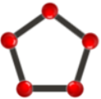

> -----------------------------------------------------------------------------------------------------
>   'canvasShapes' (namespace) - Library of creation, manipulation and calculation of flat geometric shapes.  
>   Library: 'PolyArea'.  
>   Author: Juan José Guerra Haba - dinertron@gmail.com - Marzo de 2016  
>   License: Free BSD. & Open GPL v.3. Keep credit, please.  
>   Versión: 0.9.0 BETA   
>   File: canvasShapes.js               Main Class: PolyArea.js  
>   
> ----------------------------------------------------------------------------------------------------
# canvasShapes

 It is a library for drawing geometric figures associated events.  
 
 It shows geometric calculations (areas, perimeters, ...) and supports a free drawn mode *"freehand"*; also it has a graphical interface with buttons bar and an options window where display / modify some of the multiple parameters supported.  
 
 *'CANVAS-SHAPES'* is actually a namespace that hold the library **'PolyArea'** which is responsible for the bulk of drawn figures, but also houses objects and methods useful in separate modules.  
 HTML element works on a *'canvas'* that constructs itself and on which it has implemented a reception event for the creation and modified the figures (points, segments, ...)

## Usage
After loading the file in the *'head'* zone (`<script src = "... / canvasShapes.js" ...> </ script>`) you can start to use the library under the namespace: *'canvasShapes'*. It could commence for example, with the viewing of the UI by the method:

    canvasShapes.render( {id: "idElement"} );
 
where the string *'idElement'* is expected that identifies the container element, that is, the element in which all imbibing *UI*.  
From here everything is done visually and interactively in the **GUI**.

## Features:
- OOP Philosophy, classes, inheritance, modularity, abstraction, ...
- *ECMASCRIPT* 6 features: `"use-strict"`.
- Cross-Browser.
- Modularity and abstraction by js-modules and Closures.
- Grouping of modules in a single file to simplify the call in the *'head'*.
- Self-content CSS, *media-queries*, *'bootstrap'* patterns.
- *OUTSTANDING !!* : Assigning events to the figures in the *'canvas'*.  
 This is really **INNOVATIVE** and that everyone knows that drawn on a canvas does not allow events, since 
 they are not objects, but the library does implement recognizing the figures drawn as objects.

## Developing
Developed by [GuerraTron](mailto://dinertron@gmail.com "author") @2016

### Tools
Notepad ++  

Created with [Nodeclipse](https://github.com/Nodeclipse/nodeclipse-1) ([Eclipse Marketplace](http://marketplace.eclipse.org/content/nodeclipse), [site](http://www.nodeclipse.org)) Nodeclipse is free open-source project that grows with your contributions.

### Author: 
 <cite>I hope it can be useful to someone as it has been for me. In this case it would be appreciated email commenting use or suggestions for future improvements.</cite> &nbsp;  
     ¡ KEEP CREDITS, PLEASE !
